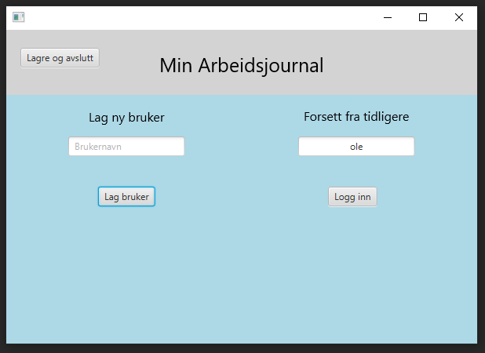
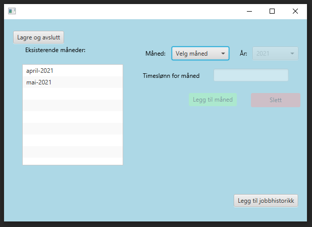
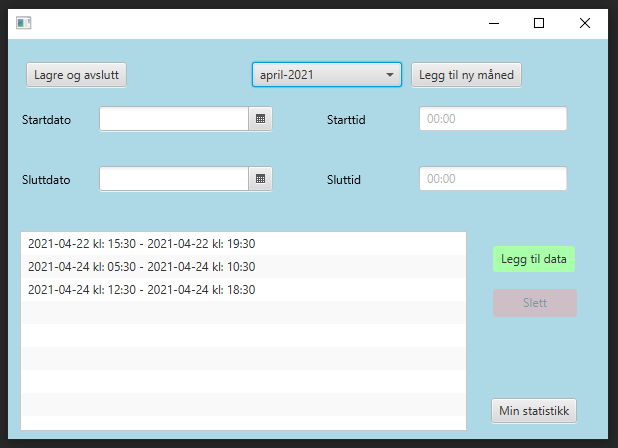
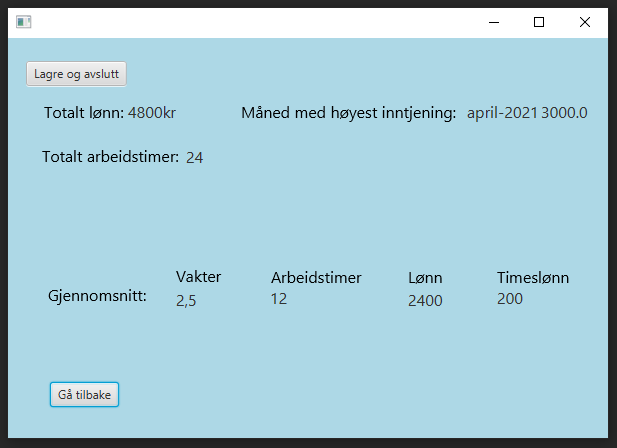
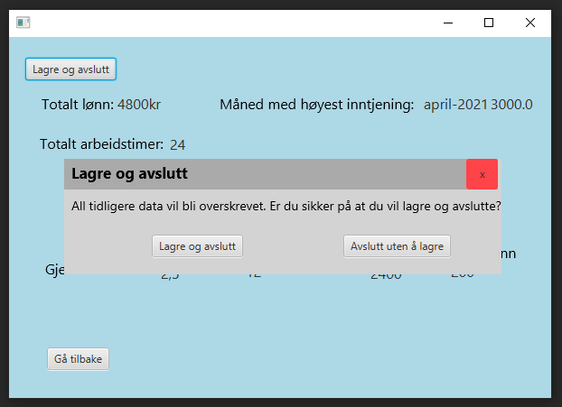

# TDT4100-Prosjekt, MyWorkJournal

MyWorkJournal er et arbeidsføringsprogram som bruker Java, JavaFX og JUnit5.

...

# Skjermbilde
###### Logge inn

###### Legge til arbeidsmåned

###### Legge til arbeid i måned

###### Statistikk for arbeid

###### Lagre og avslutte

